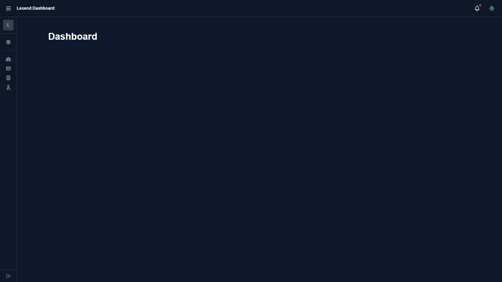

# Lexend Project
A dashboard project using tailwind css, alpine js

## Setup

1. Clone the repository:
```bash
git clone https://github.com/yourusername/Lexend.git
```

2. Navigate to the project directory:
```bash
cd Lexend
```


## Preview
